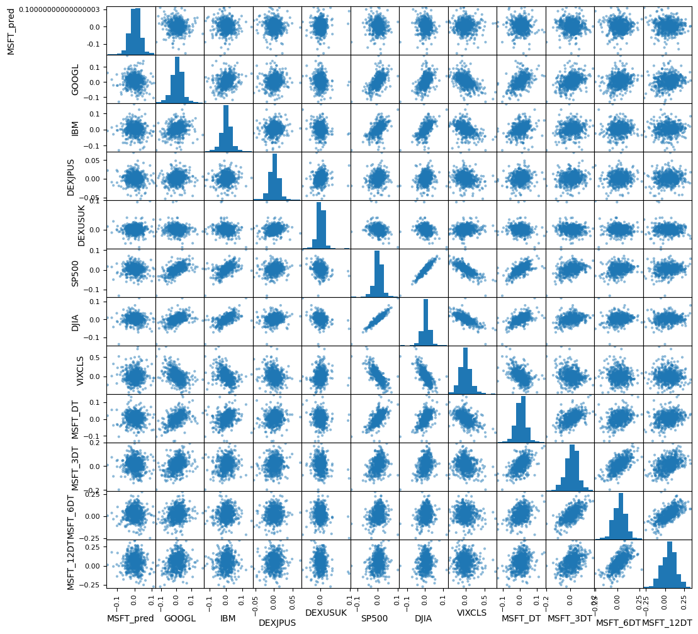

# Dự Án Dự Đoán Giá Cổ Phiếu MSFT (Stock Price Prediction)

Dự án này sử dụng các kỹ thuật Học máy (Machine Learning) và Học sâu (Deep Learning) để dự đoán xu hướng và tỷ suất sinh lời của cổ phiếu Microsoft (MSFT). Dự án triển khai một pipeline đầy đủ từ thu thập dữ liệu tự động, tiền xử lý, phân tích dữ liệu khám phá (EDA), đến huấn luyện, so sánh hiệu năng của nhiều mô hình khác nhau và tìm kiếm siêu tham số tối ưu (Hyperparameter Tuning).

## 🚀 Tính Năng Chính
- **Thu thập dữ liệu tự động**: Tải dữ liệu lịch sử giá cổ phiếu và tỷ giá hối đoái trực tiếp từ Yahoo Finance (`yfinance`).
- **Phân tích dữ liệu khám phá (EDA)**:
  - Trực quan hóa ma trận tương quan giữa các biến (Correlation Matrix).
  - Phân tích mối quan hệ phân tán (Scatter Matrix).
  - Phân tách chuỗi thời gian thành các thành phần xu hướng, chu kỳ (Seasonal Decomposition).
- **So sánh đa mô hình (Regression & Ensemble)**:
  - Mô hình hồi quy cơ bản: Linear Regression (LR), Lasso, ElasticNet (EN).
  - Mô hình phi tuyến: K-Nearest Neighbors (KNN), Decision Tree (CART), Support Vector Regression (SVR), Multi-layer Perceptron (MLP).
  - Mô hình Ensemble: AdaBoost, Gradient Boosting, Random Forest, Extra Trees.
- **Mô hình chuỗi thời gian & Học sâu**:
  - Mô hình ARIMA với các biến ngoại sinh (exogenous variables).
  - Mô hình mạng neural hồi quy LSTM (Long Short-Term Memory).
- **Tối ưu hóa mô hình**: Tự động hóa quá trình tìm kiếm tham số tối ưu (Grid Search) cho mô hình ARIMA.
- **Đánh giá & Trực quan hóa**:
  - Đánh giá chéo K-fold (10-fold cross-validation).
  - So sánh trực quan sai số huấn luyện (Train Error) và kiểm thử (Test Error) của tất cả các mô hình.
  - Vẽ biểu đồ so sánh giá trị thực tế (Actual) và giá trị dự đoán (Predicted).

---

## 📂 Cấu Trúc Thư Mục
```text
STOCK-PRICE-PREDICTION/
├── main.py                    # Luồng xử lý chính của dự án (tải dữ liệu, huấn luyện, đánh giá)
├── Algorithm Comparison.png   # Biểu đồ so sánh hiệu năng các thuật toán
├── Correlation Matrix.png     # Ma trận tương quan giữa các đặc trưng
├── MSFT.png                   # Biểu đồ so sánh giá trị dự đoán của ARIMA tuned vs thực tế
├── README.md                  # Hướng dẫn sử dụng dự án
└── .gitignore                 # Các tệp tin bỏ qua khi lưu trữ lên Git
```

---

## 🛠️ Yêu Cầu Hệ Thống & Cài Đặt

### 1. Yêu cầu hệ thống
- Python 3.8+
- Các thư viện khoa học dữ liệu và học máy chính:
  - `numpy`
  - `pandas`
  - `yfinance`
  - `matplotlib`
  - `seaborn`
  - `scikit-learn`
  - `statsmodels`
  - `tensorflow` / `keras`

### 2. Cài đặt chi tiết
Bạn có thể cài đặt các thư viện cần thiết bằng lệnh sau:
```bash
pip install numpy pandas yfinance matplotlib seaborn scikit-learn statsmodels tensorflow
```

---

## 📈 Quy Trình Thực Hiện & Dữ Liệu

### 1. Chuẩn bị đặc trưng (Feature Engineering)
Dự án tải dữ liệu của cổ phiếu mục tiêu cùng các chỉ số thị trường khác làm đặc trưng để tăng độ chính xác dự đoán:
- **Cổ phiếu dự đoán (Target)**: Tỷ suất sinh lời kỳ hạn 5 ngày tiếp theo của `MSFT` (Microsoft).
- **Cổ phiếu công nghệ tương quan**: `GOOGL` (Google), `IBM`.
- **Tỷ giá hối đoái**: `JPY=X` (USD/JPY), `GBP=X` (GBP/USD).
- **Chỉ số thị trường**: `SPY` (S&P 500), `DIA` (Dow Jones), `^VIX` (Chỉ số đo lường trạng thái biến động thị trường).
- **Đặc trưng độ trễ (Lag features)**: Tỷ suất sinh lời trong quá khứ của chính MSFT ở các mốc thời gian khác nhau (5 ngày, 15 ngày, 30 ngày, 60 ngày).

### 2. Phân tích tương quan
Ma trận tương quan giúp xác định mối quan hệ tuyến tính giữa các biến đặc trưng và biến mục tiêu:


---

## 📊 Kết Quả So Sánh Hiệu Năng

Dự án đánh giá hiệu năng các mô hình bằng chỉ số sai số bình phương trung bình (Mean Squared Error - MSE). Dưới đây là kết quả huấn luyện và đánh giá trên tập Test:

### 1. So sánh giữa các thuật toán Machine Learning
Biểu đồ so sánh phân phối sai số của kiểm định chéo K-fold và sai số Train/Test:


### 2. Dự báo thực tế với Tuned ARIMA Model
Sau khi tối ưu hóa tham số `(p, d, q)` cho mô hình ARIMA kết hợp các biến ngoại sinh, đây là kết quả so sánh xu hướng tích lũy thực tế của MSFT so với dự đoán:



---

## 🏃 Hướng Dẫn Chạy Dự Án

Để thực thi toàn bộ luồng huấn luyện, phân tích và xuất biểu đồ, bạn chỉ cần chạy file `main.py`:
```bash
python main.py
```
*Lưu ý: Quá trình chạy có thể mất vài phút để huấn luyện mạng LSTM và thực hiện Grid Search cho ARIMA.*

---

## 📝 Giấy Phép & Bản Quyền
Dự án được phát triển nhằm mục đích nghiên cứu và học tập trong lĩnh vực Phân tích Tài chính định lượng (Quantitative Finance) và Machine Learning.